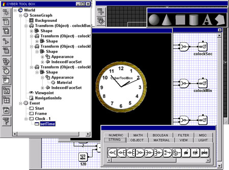
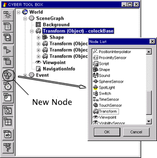
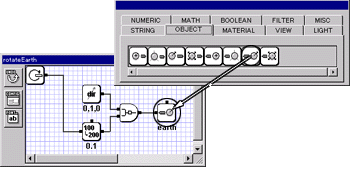
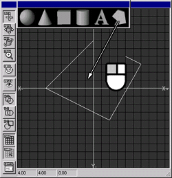
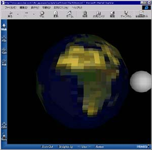
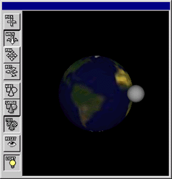
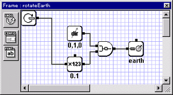
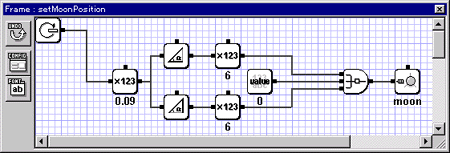
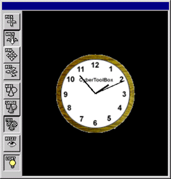
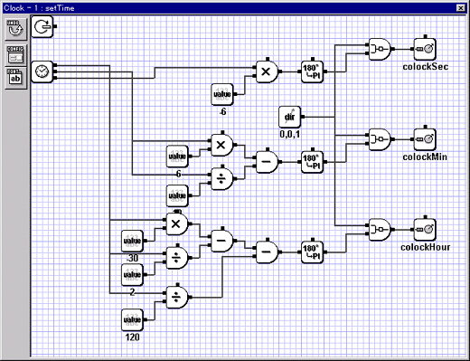

# CyberToolbox for WIN32

CyberToolbox for WIN32 is a VRML2.0/97 authoring tool. VRML is the most standard 3D file format on Web. However, It is difficult to create good interactive contents for beginner creators who have not been studied computer programming languages, because the creators have to use the programming languages, Java or Java Script, to create the good interactive behaviors. The CyberToolbox has a visual programming language so that the creators can create the interactive behaviors using a mouse easily.



## SceneGraph Editor

The CyberToolbox has a visual scene graph editor. The window shows a current scenegraph and behavior diagrams, you can add new scenegraph from VRML files into a current world, save the current world into a VRML file, add new nodes, edit the node infomation, start and stop the simulation, create new behavior diagrams.



## Behavior Editor

The CyberToolbox has many modules that are defined useful tasks. The window is a workspace which you can create behaviors using the moduels. You can create good behaviors only to connect the modules by data-flow lines using a mouse.



## World Editor

The CyberToolbox has a simple modeler. Using the modeler, you can see the world by a plane view, add new objects, edit the objects.



## VRML97

Because contents which are created using CyberToolbox is saved into a standard VRML97 file with some Java class files which are used to run the behaviors, everyone can see the contents using general browsers, Microsoft Internet Explore or Netscape Communicator, with VRML plug-ins.



I have developed CyberToolbox with CyberVRML97ForCC. If you have any interest in VRML application developments, yon can get the information in more detail from here.

## Samples

The following are two samples are created using CyberToolbox. The samples are distributed with a CyberToolbox download package.

### Earth and Moon

The sample has two objects, a earth and a moon. The earth is rotated around the midpoint, the moon is rotated in the earth.



The behavior diagram of the earth is bellow. The diagram is executed when a frame event is generated, and the earth is rotated around a y-axis in the world using the frame number.



The behavior diagram of the moon is bellow. The diagram is executed when a frame event is generated, and the moon is moved around the earth using the frame number.



### Clock

The sample shows a current time using 3D objects.



The behavior diagram of the clock is bellow. The diagram is executed when a frame event is generated, and the clock objects are rotated around z-axis in the world using a current system time.



The rotation angles are caluculated in the diagram using the following algorithm.

```
csHour = current system hour
csMinute = current system minute
csSecond = current system second
clockHour angle = (-30 *  csHour) - (csMinute / 2) - (csSecond / 120)
clockMin angle = (-6 * csMinute) - (csSecond / 10)
clockSec angle = (-6 * csSecond)
```

## Resources

- [CyberToolbox User's Guide Release 2.1 \(Japanese\)](doc/ctbwin32usersguide210j.pdf)

## Revision

Revision | Date | Detail
---|---|---
2.2 | 06/20/2002 | Released as a open source project. \<br\>Removed the licence check code. \<br\>Linked the latest libraries, libpng, zlib, CyberVRML97.
2.1 | 03/08/1999 | Added new behavior module, geometry caluculation, navigator modules etc..
2.0.2 | 01/07/1999 | Added route editing function. \<br\>Fixed some parser bugs.
2.0.1 | 10/14/1998 | Fixed some Japanse message. \<br\>Fixed the licence code algorithm.
2.0 | 10/01/1998 | The first release.
